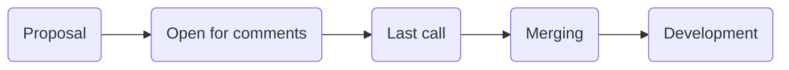

## RFC for RFCs

Based on team wide conversations I wanted to suggest the process (or as Matt named it an Etiquette) for handling RFCs. We found the institution of RFCs proposed by Yegor extremly useful. This conversation is an attempt to solidify a second, upgraded iteration.

### Dual purpose of RFC

It shows that RFCs serve a dual purpose:
- facilitate process for making architectural decision
- hold current state of architecture

To serve those purposes well the process needs to be:
- transparent for all the team members
- as simple to follow as possible
- with well defined expectations from everyone
- final - allowing no further doubt or dispute

### Minimal set of upgrades
I wanted to suggest introduction of the following code of conduct:
- [ ] each piece of architecture lives in the separate folder in the root of RFCs repo
- [ ] each change to the architecture (or a new proposal) lives on a separate PR
- [ ] each PR has a maintainer that creates initial proposal and is responsible for keeping RFC up to date
- [ ] devs that want to participate in the discussion add themselves as code owners to the PR so that their review is necessary for closing PR
- [ ] the process is divided into [stages](#Stages) and PR is labeled to reflect a current [stage](#Stages)
- [ ] each [stage](#Stages) is timeboxed and current deadline is displayed in the PR description (date + time UTC)
- [ ] PR should be closed before development starts
- [ ] changes to the architecture resulting from new discoveries while coding need to be proposed on a separate PR and signaled to the rest of stakeholders

#### Stages

- Proposal:
    - developer creates `README.md` doc with proposal of the architecture
    - this doc is located in the folder with descriptive name (e.g. `RFCs-etiquette`, no date here)
    - it's pushed to the github on new branch named `yyyymm/subject` (e.g. `201911/RFCs-etiquette`)
    - dev creates PR with descriptive name (e.g. `Propose RFC etiquette`) and labels it `open`

- Open for comments:
    - this is a divergent stage, where everyone interested starts conversation
    - by default it should last 7 days and can be changed if needed
    - PR is labeled `open`
    - PR description is updated with the deadline for this stage
    - a new commit with changes can be pushed by maintainer after a conversation is resolved

- Last call:
    - this is a convergent stage where the goal shoul be to resolve all outstanding conversations
    - by default it should last 2 days and can be changed if needed
    - PR is labeled `last call`
    - PR description is updated with the deadline for this stage
    - **no new conversation should be started**

- Merging:
    - maintainer merges PR after resolving all the conversations
    - once PR is merged it becomes an accepted architecture
    - the label from PR is removed
    - at this stage an architected piece is ready for development

- Development:
    - should follow architectural decisions from RFC
    - once new issues arise with architecture new PR should be created - this gives space for conversation between stakeholders and ensures our documentation is up to date

#### Good practie:
- close conversations quickly and push updating commits right away so that HEAD is reflecting current state of decisions
- do not let open stage to drag for too long - ride the wave of excitment among stakeholders
- for bigger pivots open a sub-PR and try to close it fast, so that branches do not get out of sync